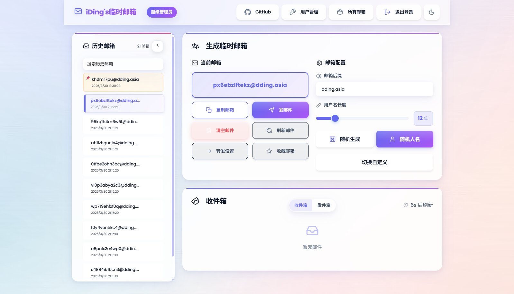
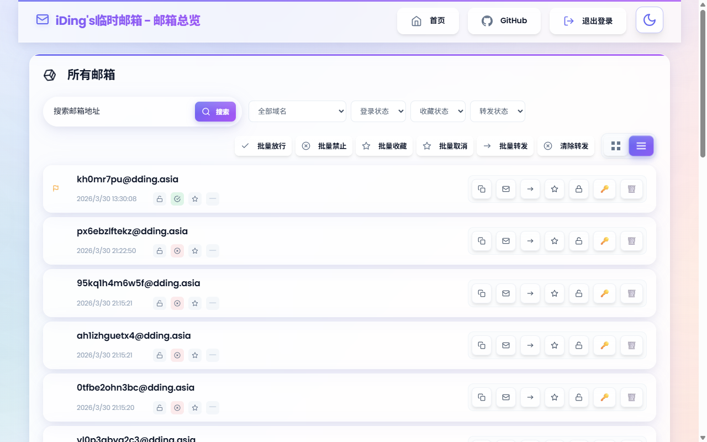
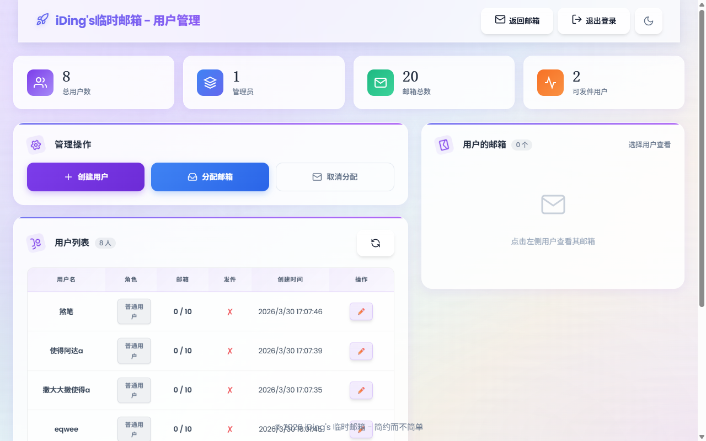

# Cloudflare 临时邮箱

[](https://deploy.workers.cloudflare.com/?url=https://github.com/ShinozakiKasumi/cloudflare-temp-mail)

一个基于 **Cloudflare Workers + D1 + R2 + Email Routing** 构建的前后端分离开源临时邮箱服务。支持邮件接收、发送、转发、多域名、用户管理与 RESTful API，前端为 React + @cloudflare/kumo 单页应用。

> 本项目基于 [idinging/freemail](https://github.com/idinging/freemail)（Apache-2.0）二次开发，V6 起前端全量重写并新增 API Key 鉴权。

## 功能特性

| 类别 | 特性 |
|------|------|
| 📧 **邮箱管理** | 随机生成临时邮箱 · 多域名支持 · 置顶/收藏 · 历史记录 · 邮箱搜索 |
| 💌 **邮件功能** | 实时接收 · 自动刷新 · 验证码智能提取 · HTML/纯文本 · 邮件转发 |
| ✉️ **发件支持** | 多渠道发件（Resend / SendFlare / Cyberpersons）· 按域名自动路由 |
| 🔑 **API Key** | 为 agent / 外部工具签发 Key 收信与管理邮箱（read/create/manage，不含发信） |
| 🎨 **前端** | React + @cloudflare/kumo 组件库 · 暗色模式 · 响应式 SPA |
| ⚡ **技术架构** | Cloudflare Workers · D1 数据库 · R2 存储 · Email Routing |

> 收信时可自动创建对应邮箱；转发目标邮箱地址需先在 Cloudflare Email Routing 的「目标地址」中完成验证。

## 页面展示

| 首页 | 所有邮箱 |
|------|----------|
|  |  |

| 用户管理 | 单个邮箱登录 |
|----------|----------|
|  |  |

[浅色模式展示](docs/zhanshi-light.md) | [深色模式展示](docs/zhanshi-dark.md)

## 文档

📖 **[一键部署指南](docs/yijianbushu.md)** | 🤖 **[GitHub Action 部署指南](docs/action-deployment.md)** | 📚 **[API 文档](docs/api.md)** | 🔄 **[多合一转发研究](docs/multi-inbox-forwarding.md)**

发件渠道配置：📬 [Resend](docs/resend.md) · 🚀 [SendFlare](docs/sendflare.md) · ☁️ [Cyberpersons](docs/cyberpersons.md)

## 快速部署

1. **一键部署**：点击顶部 Deploy 按钮，按照 [部署指南](docs/yijianbushu.md) 完成配置
2. **配置邮件路由**（收件必需）：Cloudflare 控制台 → 域名 → Email Routing → Catch-all → 绑定到本 Worker
3. **配置发件**（可选）：参考上方发件渠道配置文档，三个渠道可同时启用

> 使用 Git 集成部署时，请在 Workers → Settings → Variables 中手动配置环境变量。

### 环境变量

| 变量名 | 说明 | 必需 |
|--------|------|------|
| TEMP_MAIL_DB | D1 数据库绑定 | 是 |
| MAIL_EML | R2 存储桶绑定 | 是 |
| MAIL_DOMAIN | 邮箱域名，多个用逗号分隔 | 是 |
| ADMIN_PASSWORD | 管理员密码 | 是 |
| ADMIN_NAME | 管理员用户名（默认 `admin`） | 否 |
| JWT_TOKEN | JWT 签名密钥 | 是 |
| RESEND_API_KEY | Resend 发件密钥，支持多域名配置 | 否 |
| SENDFLARE_API_KEY | SendFlare 发件密钥，格式同 Resend | 否 |
| CYBERPERSONS_API_KEY | Cyberpersons 发件密钥，格式同 Resend | 否 |
| FORWARD_RULES | 邮件转发规则 | 否 |
| GUEST_PASSWORD | 访客体验密码 | 否 |
| SESSION_EXPIRE_DAYS | 登录会话有效天数 | 否 |

`ADMIN_PASSWORD` 与 `JWT_TOKEN` 建议通过 `npx wrangler secret put <NAME>` 上传，不要写进 `wrangler.toml`。

## 本地运行

本地运行适合调试前端页面、管理接口和发件逻辑。真实收信依赖 Cloudflare Email Routing，需部署后才能完整验证。

1. **安装依赖**

```bash
npm install
```

2. **配置本地变量**

按需修改 `wrangler.toml` 中的 `[vars]`、D1 和 R2 绑定，或在项目根目录创建 `.dev.vars`（已在 .gitignore 中忽略）：

```bash
ADMIN_NAME=admin
ADMIN_PASSWORD=your_admin_password
JWT_TOKEN=your_random_jwt_secret
MAIL_DOMAIN=example.com
```

3. **初始化本地 D1 数据库**

```bash
npx wrangler d1 execute mail-free-db --local --file=./d1-init.sql
```

如果你修改了 `wrangler.toml` 中的 `database_name`，请把上面的 `mail-free-db` 替换为你的数据库名称。

4. **启动本地开发服务**

前端为独立 Vite + React 工程（`frontend/`），构建产物输出到 `public/` 供 Worker 托管。一键启动（先构建前端再起 wrangler）：

```bash
npm run dev      # = npm run build:frontend && wrangler dev
```

如需前端热更新调试，可分两端启动：终端 A 起后端 `npx wrangler dev`，终端 B 在 `frontend/` 目录执行 `npm install && npm run dev`（Vite dev server，`/api` 代理到 `127.0.0.1:8787`）。

启动后访问 Wrangler 输出的本地地址即可。默认管理员账号为 `admin`，密码为 `ADMIN_PASSWORD`。

## 目录结构

```
├── src/               # Worker 后端（Hono）
│   ├── api/           # REST API（邮箱 / 邮件 / 用户 / API Key / 发件）
│   ├── db/            # D1 数据访问层
│   ├── email/         # 收信处理、转发与发件渠道（providers/）
│   ├── middleware/    # 鉴权与应用中间件
│   └── routes/        # 路由与静态资源
├── frontend/          # Vite + React + @cloudflare/kumo 前端工程
├── docs/              # 部署、API、发件渠道与转发文档
├── security/          # 安全回归验证脚本
├── d1-init.sql        # D1 表结构初始化
└── wrangler.toml      # Cloudflare 配置
```

## 故障排除

1. **邮件接收不到**：检查 Email Routing 配置、MX 记录、MAIL_DOMAIN 变量
2. **数据库连接错误**：确认 D1 绑定名为 `TEMP_MAIL_DB`，检查 database_id
3. **登录问题**：确认 ADMIN_PASSWORD 和 JWT_TOKEN 已设置，清除浏览器缓存
4. **界面显示异常**：检查静态资源路径，查看浏览器控制台错误

```bash
# 查看实时日志
wrangler tail

# 检查数据库
wrangler d1 execute TEMP_MAIL_DB --command "SELECT * FROM mailboxes LIMIT 10"
```

## 注意事项

- **静态资源缓存**：更新后在 Cloudflare 控制台 Purge Everything，浏览器强制刷新
- **R2/D1 费用**：有免费额度限制，建议定期清理过期邮件
- **安全**：生产环境务必修改默认的 `ADMIN_PASSWORD` 和 `JWT_TOKEN`

## 致谢

- 原项目：[idinging/freemail](https://github.com/idinging/freemail)
- 感谢 [sarsanta](https://github.com/sarsanta) 贡献的 GitHub Actions 自动部署功能
- 感谢 [oxygen](https://github.com/daimiaopeng) 贡献的越权漏洞报告及修复

## 许可证

Apache-2.0 license
